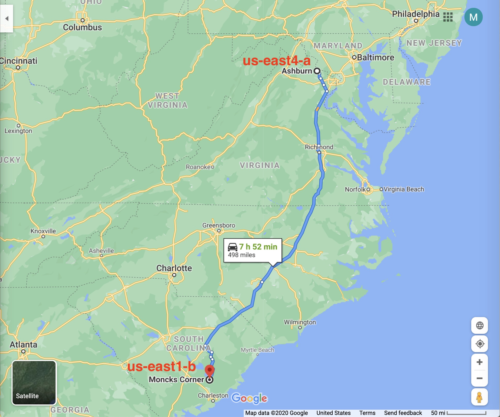

# crdb-demos-fall-2020

Some demos and experiments using CockroachDB.
These are run using v20.1.5 of CockroachDB.

## Setup

* A single, 3 node cluster [installed via roachprod](./roachprod_3_gcp.sh)
* An SSH tunnel to the `remote_ip` of one cluster node:
```
ssh -f -N -T -L $local_port:localhost:26257 $remote_ip
```

## Indexing of computed columns

* DDL: table and indexes

```
CREATE TABLE movies
(
  title_lc STRING
  , actors_lc STRING[]
  , genres_lc STRING[]
  , yr INT
  , agg JSONB
  , FAMILY (title_lc, actors_lc, genres_lc, yr)
  , FAMILY (agg)
);
CREATE INDEX ON movies (yr);
CREATE INDEX ON movies (title_lc);
CREATE INDEX ON movies USING GIN(actors_lc);
CREATE INDEX ON movies USING GIN(genres_lc);
```

* [Python example](./computed_columns.py) loads/prepares data as follows:
1. Ingest JSON formatted data (Source: https://raw.githubusercontent.com/prust/wikipedia-movie-data/master/movies.json)
1. Pull fields out of it, into their own columns
1. Lower case these extracted fields
1. Index the lower cased versions, plus the `yr` column (the year)
1. Build inverted indexes on the `actors_lc` and `genres_lc` columns
1. Store the original JSON intact, in the `agg` column (in its own column family)

* Query the data using the indexes of the computed columns; e.g.

```
SELECT agg->>'title' "Title", yr "Year", agg->'cast' "Cast"
FROM movies
AS OF SYSTEM TIME experimental_follower_read_timestamp()
WHERE genres_lc @> ARRAY['adventure']
ORDER BY yr DESC
LIMIT 10;
```

## 2 Data Center Using CDC



* [This script](./roachprod_3_gcp.sh) documents the setup and running of this demo, which consists of two 3 node CockroachDB
clusters installed in Google Cloud data centers separated by 800 km.

## AS OF SYSTEM TIME ...

* Data loader is [here](./load_osm_offset.py). Set these environment variables prior to running: `PGHOST, PGPORT, PGUSER, PGPASSWORD, PGDATABASE`
* The [data set](https://storage.googleapis.com/crl-goddard-gis/osm_10m_eu.txt.gz) is a refined extract from the OpenStreetMap data set

* Create the `osm` table:

```
CREATE TABLE osm
(
  id BIGINT
  , date_time TIMESTAMP WITH TIME ZONE
  , uid TEXT
  , name TEXT
  , key_value TEXT[]
  , lat FLOAT8
  , lon FLOAT8
  , geohash4 TEXT -- first N chars of geohash (here, 4 for box of about +/- 20 km)
  , CONSTRAINT "primary" PRIMARY KEY (geohash4 ASC, id ASC)
);

```

* Load 1M rows of the OpenStreetMap data set.  The `sleep 60` is done to facilitate doing incremental deletes; the `100000` specifies the number
of rows to load (so, each 60 seconds, 100k rows would be loaded and the total would be 1M rows).  The `110000` value is the number of lines of
the input file to skip each time; it's higher than expected, by 10k, because the loader skips malformed rows.


```
$ for i in {1..10} ; do n=$(( i * 110000 )) ; time ./load_osm_no_gis.py osm_10m_eu.txt.gz 100000 $n ; sleep 15 ; done
```

* Run this query with the `AS OF SYSTEM TIME ...` commented out (as shown).  If this is run *during the data load*, the effect
of the `AS OF SYSTEM TIME` clause will be far more pronounced, and it may be necessary to use the line with the `-180s` value.

```
SELECT name, geohash4, id, date_time, key_value
FROM osm
-- AS OF SYSTEM TIME experimental_follower_read_timestamp()
WHERE key_value @> ARRAY['gcpv', 'amenity=pub', 'real_ale=yes']
ORDER BY geohash4, id
LIMIT 10;
```

* Uncomment one of the `AS OF SYSTEM TIME ...` lines and re-run, observing the effect on runtime.
* Building a GIN index on the `key_value` columns is essential for good performance:
```
CREATE INDEX ON osm USING GIN(key_value);
```

## Moving / exchanging partitions – data archivization

* Interpreting this as how to efficiently delete older data 
* [Related GitHub issue](https://github.com/cockroachdb/docs/issues/5647)
* Example, using the same OSM data set, loaded in batches for the above:

* (*CURRENT*) Create an index on `date_time`

```
CREATE INDEX ON osm(date_time);
```

* Get a sample of the `date_time` values:
```
SELECT DATE_TRUNC('year', date_time), COUNT(*)
FROM osm
GROUP BY 1
ORDER BY 2 DESC;
```

* Run deletes on this date range, in batches (here, 10k):
```
DELETE FROM osm
WHERE date_time < '2008-01-01 00:00:00'::TIMESTAMP
LIMIT 10000;
```

* (*IN NEXT RELEASE*) Get a sample of the MVCC timestamps:
```
SELECT DATE_TRUNC('minute', (crdb_internal_mvcc_timestamp/1.0E+09)::INT::TIMESTAMP), COUNT(*)
FROM osm
GROUP BY 1
ORDER BY 1 DESC;
```

* Delete a batch of 10k rows:
```
DELETE FROM osm -- Takes ~ 30 s for 10k and ~ 74 s for 100k (on a MacBook Pro)
WHERE crdb_internal_mvcc_timestamp < '2020-09-06 02:00:00'::TIMESTAMP::INT*1.0E+09
LIMIT 10000;
```


